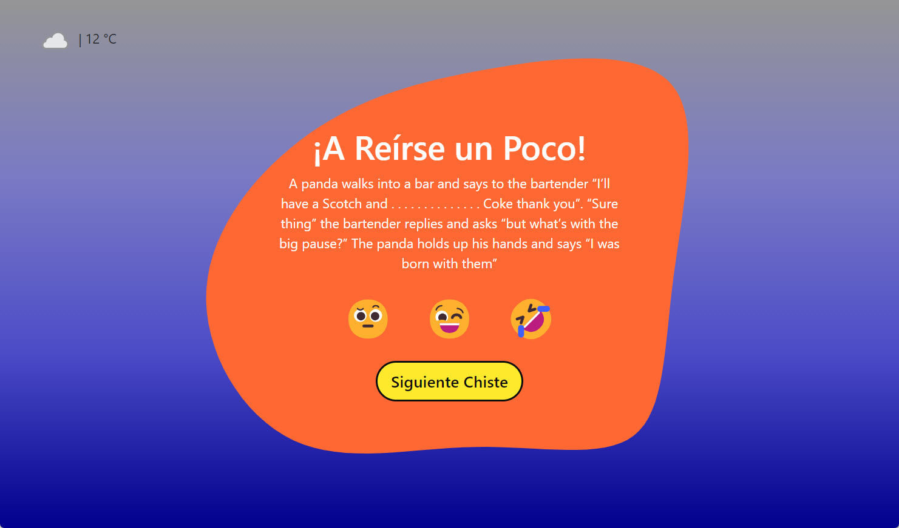

# Random Jokes App

## Descripción

En este repositorio, encontrarás los recursos para la actividad del Sprint 4 de Barcelona Activa. Se trata de una aplicación web diseñada para mejorar el ambiente laboral mediante la presentación de chistes antes de comenzar la jornada laboral.

## Características

- Muestra chistes de manera aleatoria.
- Permite evaluar la gracia de los chistes.
- Integra un cambio de color dinámico para una experiencia visual agradable.

## Tecnologías Utilizadas

- TypeScript
- HTML5
- SASS (Bootstrap)
- Consumo de API externa para obtener chistes y datos meteorológicos

## Demo

Puedes ver una demo en línea de esta aplicación en el siguiente enlace:

[Random Jokes](https://yul1b3th.github.io/barcelona-activa-sprint4/views)